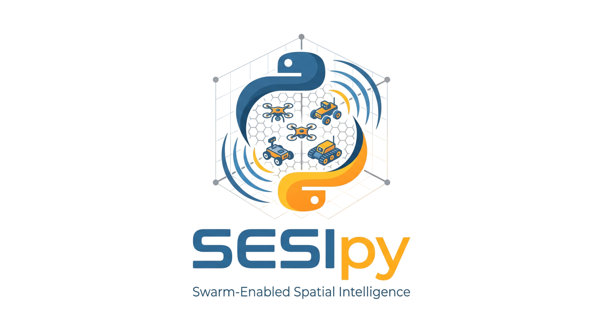

# SWARM-ENABLED SPATIAL INTELLIGENCE (SESI)

Welcome to SESIpy, an advanced 3D modelling engine for autonomous mapping and monitoring of the radio frequency domain using robotic agents. SESIpy offers 2D and 3D simulations environments as well as real-robotics implementations using ROS2. Electromagnetic propagation modelling is handled by the open-source python library LyceanEM [(github)](https://github.com/LyceanEM/LyceanEM-Python/tree/master). SESIpy incorporates these solvers into a versatile, user-friendly API for use with robotics and robotics-simulation.  
