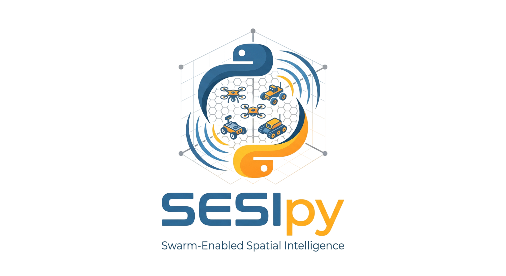

# SWARM-ENABLED SPATIAL INTELLIGENCE (SESI)

Welcome to SESIpy, an advanced 3D modelling engine for autonomous mapping and monitoring of the radio frequency domain using robotic agents. SESIpy offers 2D and 3D simulations environments as well as real-robotics implementations using ROS2. Electromagnetic propagation modelling is handled by the open-source python library LyceanEM [(github)](https://github.com/LyceanEM/LyceanEM-Python/tree/master). SESIpy incorporates these solvers into a versatile, user-friendly API for use with robotics and robotics-simulation.  

## Modules

SESIpy is broken down into a series of modules and sub-modules that concentrate on different aspects of the technology.

### Engines

#### *Spatial Intelligence*

This is the central node of the library. The spatial intelligence module is responsible for the creation, handling and simulation of electromagnetic simulations through meshes. Here, 3D scenes are initialized that contain the physical structure of the environment, as well as the desired antennas for receiving and transmitting signals. Furthermore, angle of arrival estimation and analysis is included.

#### *Mapping*

The mapping module is responsible for incorporating 2D and 3D sensor data into an agents intelligence arsenal. Included are methods to extract meta data from pgm maps and LiDAR scans in order to reconstruct a given environment. From here, agents are able to gain an understanding of the world they are operating in and can make informed, spatially-aware decisions about their sampling methods.

#### *Evaluation*

The evaluation module is concerned with the comparison of simulations against true measurements. Mainly, this will be used to improve localization accuracy by reducing the ambiguities of angle of arrival estimations, in particular NLOS transmission, towards scatterers.
